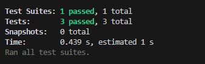

# Object-oriented-programming-challenge-10

## Description

The reason for this project was to use object oriented programming to generate a logo. In this challenge the user wants to have a simple logo generated when promoted certain questions. Questions like providing 3 letter and a color for those letters, then pick between 3 shapes which are triangle, square, and circle for the letters to be placed on. Also the color of the shape.

## Usage

demo video: https://drive.google.com/file/d/1yCb9pjRqlKZ54Iol9Cx3QtDoU71LZHHS/view

## Screenshots

## License
MIT License